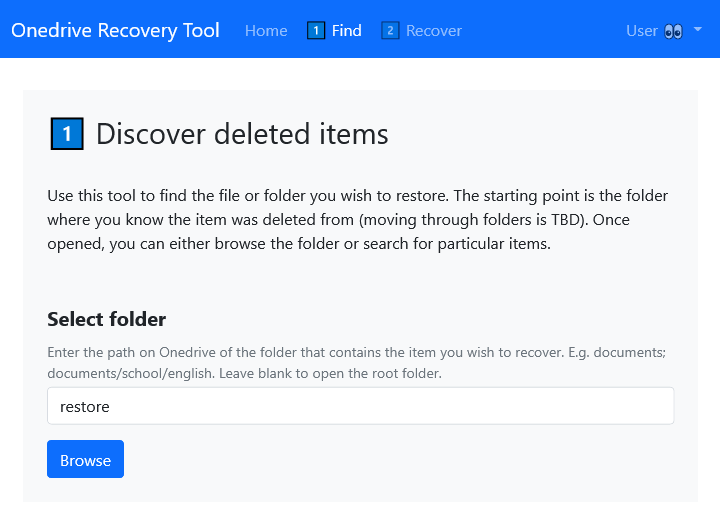

# Onedrive Recovery Tool

A simple **experimental** tool for recovering deleted files and folders from your personal Onedrive using [MS Graph](https://docs.microsoft.com/en-us/graph/overview).

## Features

* Find and retrieve lost files and folders that can otherwise be hard or impossible to recover from the Onedrive recycle bin.
* Quickly bulk restore an entire folder and its contents.
* Recursively recover deleted files and folders if bulk restore is not possible.
* Version control: select which version to recover.
* With the suggested setup, can only connect to your personal Onedrive account (no security risk)

## Picture This (a.k.a. why is this tool necessary?)

Let's say you just deleted an important folder by accident. Before discovering this, however, you delete a few other folders containing more than 200,000 files (node\_modules...).

Then you realize your mistake and you trudge over to the Onedrive recycle bin to recover your precious files. What's he recycle bin for if not to rescue you in an emergency? But there's a problem.

The recycle bin lists files by the date they were deleted - and the list cannot be *sorted, cannot be filtered, cannot be searched.* If the files you want are more than a few thousand files down, you can't scroll either, because it only loads *100 files at a time.* Neither is it possible to permanently delete files down the list until you get where you want, because selecting thousands of files takes an eternity, waiting for files to be deleted takes another eternity, and in the end, it's very likely to time out or fail for mysterious reasons.

The 'recycle bin' in Onedrive is a travesty. There is always the nuclear option -- a full recovery to a previous date -- but, well, it's nuclear. In short, it's a pain.

## Preview

## EXPERIMENTAL SOFTWARE -- USE AT OWN RISK

This app was developed to solve an immediate personal problem and it also served as a playground for creating a basic app and UI framework. In the end, it allowed me to recover several gigs of deleted files and folders. It was extensively tested with regard to edge cases before I dared using it, especially cases of multiple versions of deleted items. Yet it is basic, and I can't claim that I understand the intricacies of either Onedrive or MS Graph well enough to claim that will work under all circumstances.

## Usage

### Setup

* Requires recent versions of `node` and `npm`
* Create a private Azure app to acquire a Graph API and Client ID and Secret Key from [https://portal.azure.com](https://portal.azure.com)
    * For instructions, see [https://docs.jamcracker.com/ver7.0/Hybrid/topic/Graph%20API%20Client%20ID%20and%20Graph%20API%20Secret%20Key.html](https://docs.jamcracker.com/ver7.0/Hybrid/topic/Graph%20API%20Client%20ID%20and%20Graph%20API%20Secret%20Key.html)
* Enter details in [src/config.js](.src/config.js)
* Compile with `npm run build` or `npm run watch`
* Run private local server with `npm start`
* Access server at [localhost:8080](http://localhost:8080)

## License

Created by Bjornar Egede-Nissen.
Licensed under [the Unlicense](./LICENSE).
